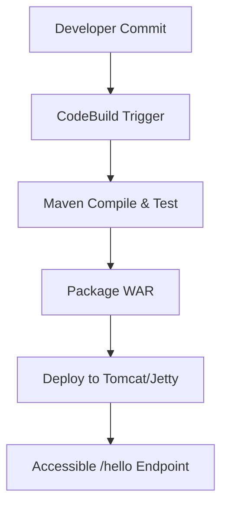

# DevOps Workflow Demo


## 📌 Overview
This project demonstrates a **Java web application** deployed with **CI/CD pipelines** using **AWS CodeBuild** and **CodeArtifact**.  
It includes a working servlet endpoint (`/hello`), Maven build configuration, and integration with AWS artifact repositories.

---

## 🚀 Quickstart
1. Clone the repository:
   ```bash
   git clone https://github.com/obintui10/devops-workflow.git
   cd devops-workflow
## 📂 Repository Structure
```text
devops-workflow/
├── pom.xml              # Maven build descriptor
├── buildspec.yml        # AWS CodeBuild pipeline
├── settings.xml         # AWS CodeArtifact integration
├── src/
│   ├── main/
│   │   ├── java/com/example/HelloServlet.java
│   │   └── webapp/WEB-INF/web.xml
│   └── test/java/...    # JUnit test classes

## Box‑Style ASCII Diagram
+---------------------------+          +---------------------------+
|       Browser Client      |  ----->  |        HelloServlet       |
+---------------------------+          +---------------------------+
                                               |
                                               v
                                   +---------------------------+
                                   |       MongoDB Atlas       |
                                   +---------------------------+

+---------------------------+          +---------------------------+
|       AWS CodeBuild       |  ----->  |     AWS CodeArtifact      |
+---------------------------+          +---------------------------+
                                               |
                                               v
                                   +---------------------------+
                                   |     Packaged WAR File      |
                                   +---------------------------+


## 🛠️ Tech Stack
- Java 11 (Corretto)
- Maven for build and dependency management
- JUnit 5 for testing
- AWS CodeBuild with buildspec.yml
- AWS CodeArtifact integration via settings.xml
```
## 🔄 Workflow

## 🌟 Future Work
- Add GitHub Actions workflow (.github/workflows/ci-cd.yml) to mirror AWS CodeBuild.
- Extend servlet functionality with REST endpoints.
- Add frontend JSP/HTML for recruiter‑friendly demo.
- Integrate monitoring with CloudWatch/Grafana.
